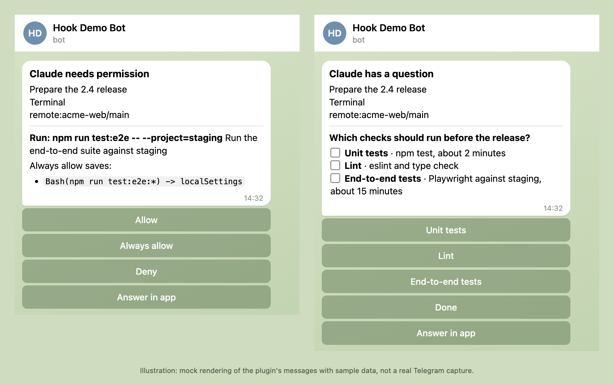
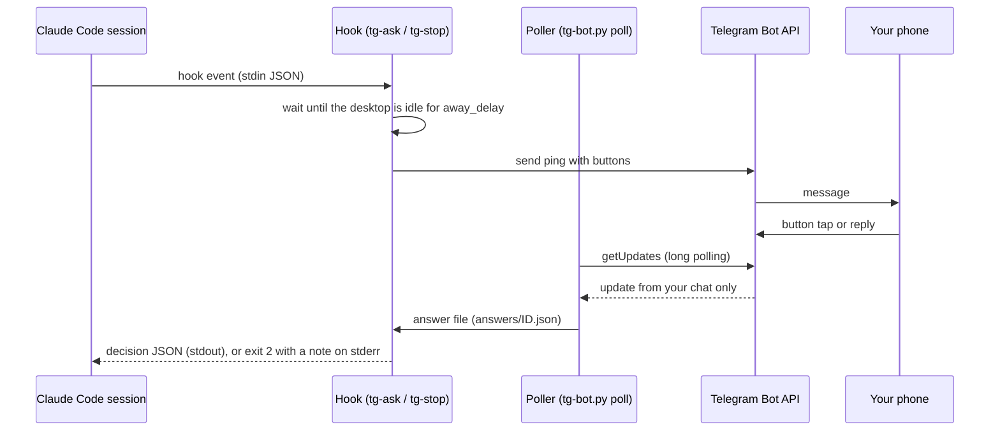
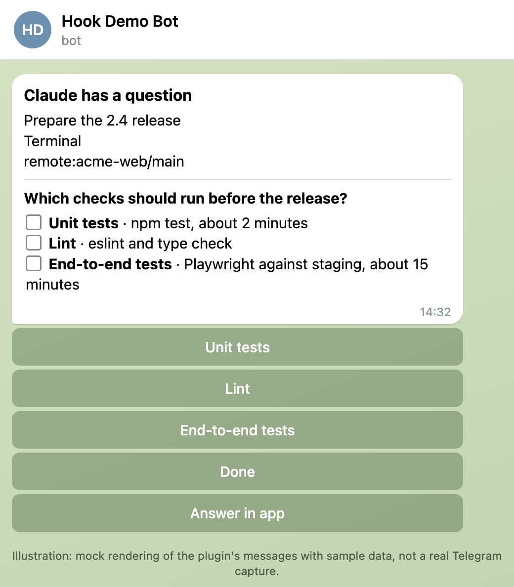
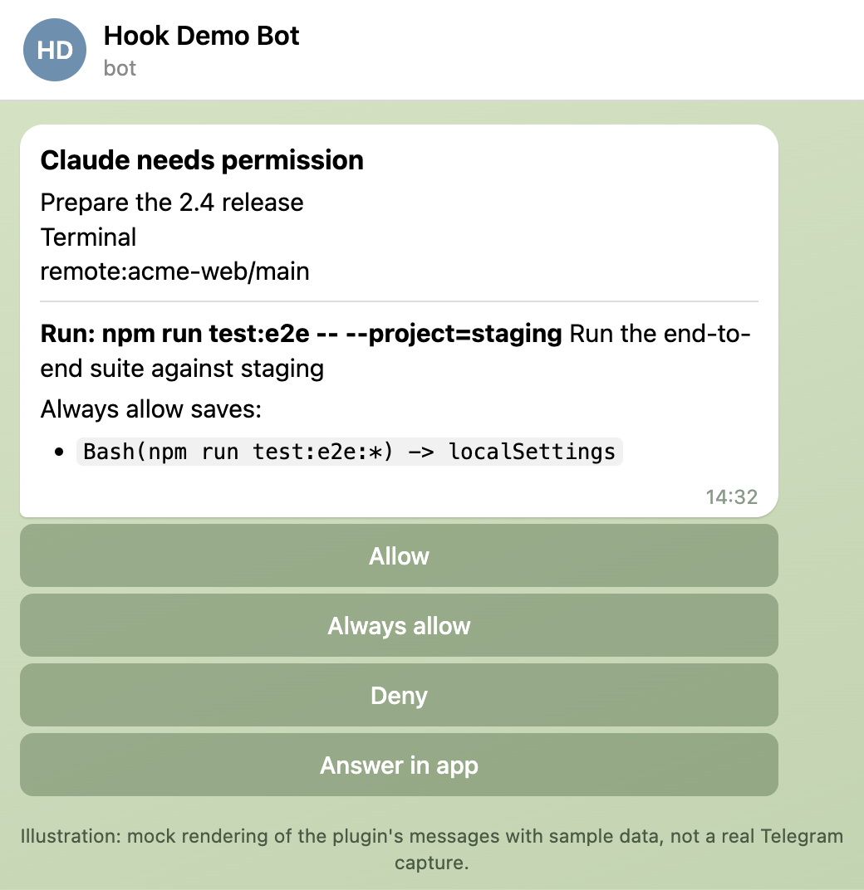
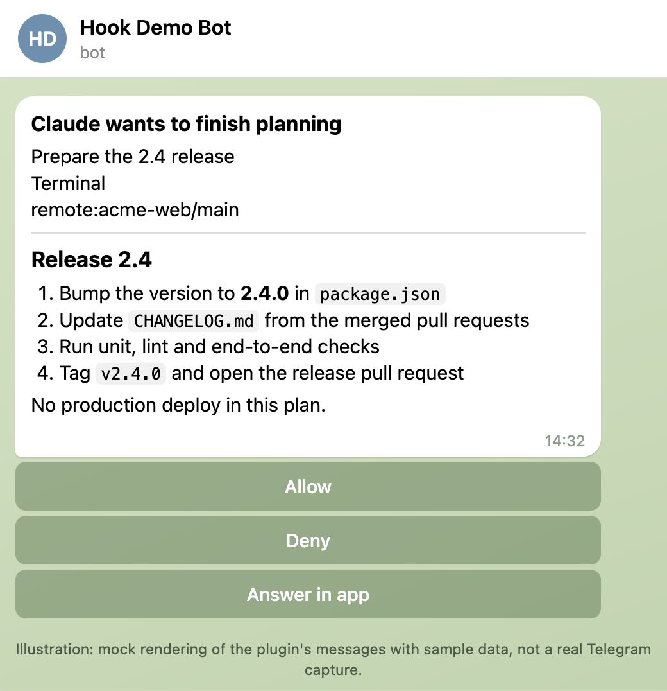
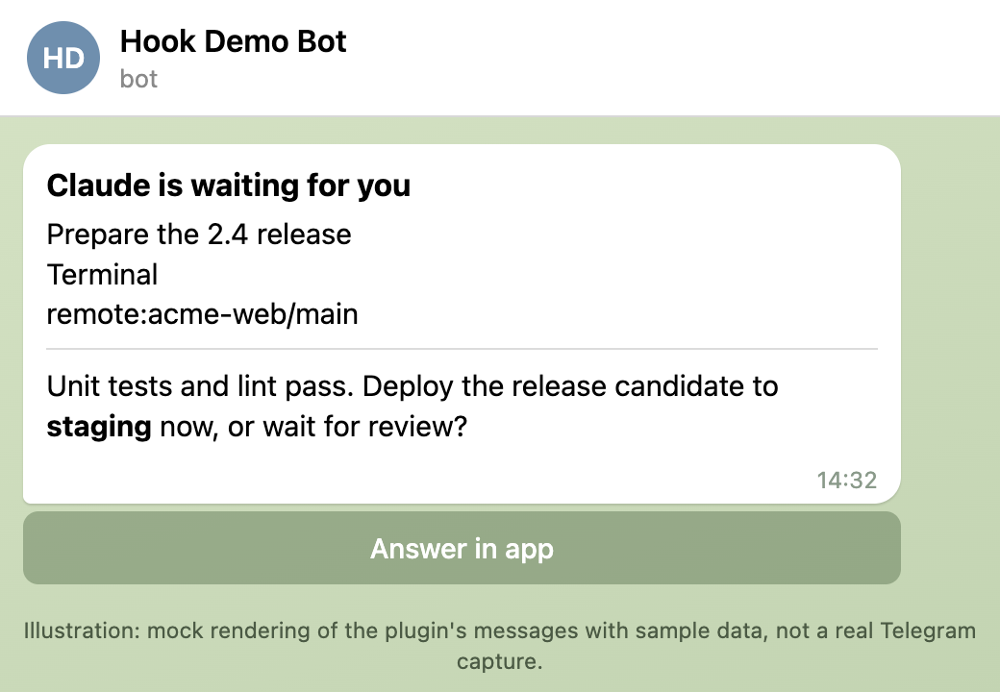
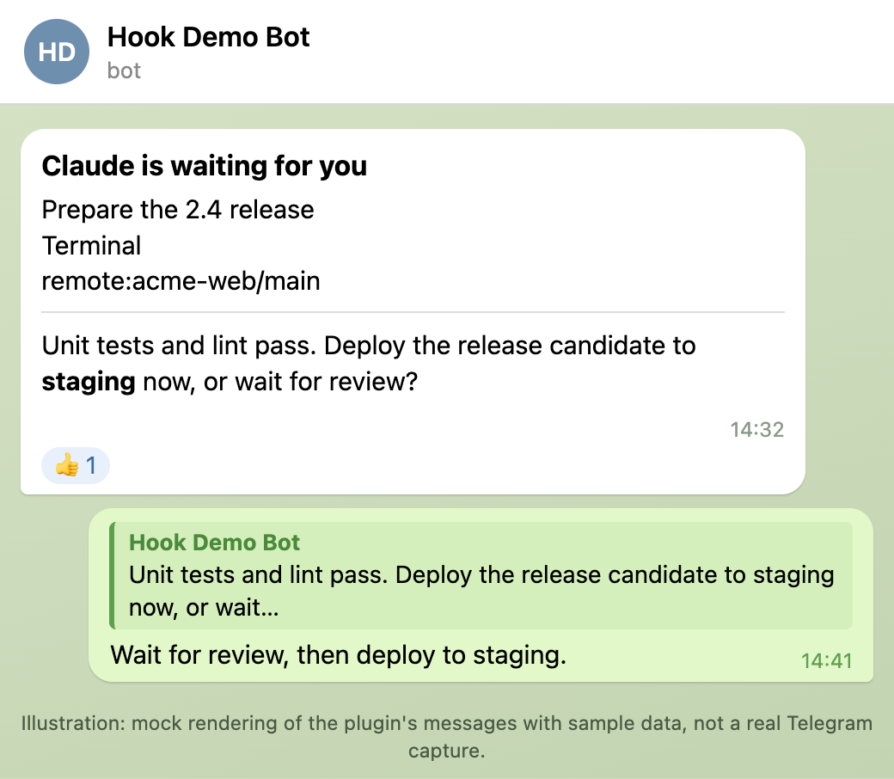

# telegram-hook for Claude Code

**Answer Claude Code from your phone.** When you step away, its questions, plan approvals and permission prompts arrive in Telegram with answer buttons; your tap or reply goes straight back into the running session.

[](https://github.com/hlebtkachenko/claude-telegram-hook/actions/workflows/test.yml)
[](https://github.com/hlebtkachenko/claude-telegram-hook/releases)
[](LICENSE)
[](#quick-start)
[](#requirements)
[](#requirements)
[](CONTRIBUTING.md)



<sub>Illustration: mock rendering of the plugin's messages with sample data, not a real Telegram capture.</sub>

telegram-hook is a Claude Code plugin: a set of hooks plus a one-tool MCP server, written in standard-library Python. It works with the sessions you already run (terminal, the Claude desktop app, Conductor); it is not a separate agent. While you are at the computer it stays silent. When a session on your Mac or Linux desktop needs you and you have been away for a while, it sends the prompt to your private chat with your own Telegram bot, and your answer goes straight back into the session.

## What reaches your phone

- **Questions** (`AskUserQuestion`): one button per option, multi-select toggles, or reply with free text.
- **Plan approval** (`ExitPlanMode`): the plan as Markdown, with Allow / Deny.
- **Permission prompts**: the command itself for shell commands ("Run: npm test", with Claude's description below it), a plain-English line for other tools ("Edit config.ts") with the raw input folded away, and Allow / Deny. Anything cut to fit is marked "(truncated, check in app)". When Claude Code suggests "don't ask again" allow rules saved to this project's local settings or the session, an **Always allow** button applies exactly those rules; the ping lists each one (`Bash(npm test) -> localSettings`). Mode changes and rules for shared or user-wide settings are never offered.
- **A turn that ends with a question**: reply to the Telegram message and Claude continues with your answer.
- **Reply to an earlier ping**: after any finished turn the session keeps listening (silently, up to away delay + reply window). Reply to any earlier ping of that session and Claude wakes up with your text.
- **Photos and files**: reply with a photo or document (the caption is its text). It is downloaded and Claude gets its local path to read.
- **API errors** (`StopFailure`): billing, auth and other errors only you can fix always ping; rate limits and other errors ping only while you are away.
- **`notify` tool**: Claude can message you when you asked to be told, or for a blocker only you can clear.

Your answer goes straight back into the session. Closed pings lose their buttons; answered ones get a thumbs-up reaction. Touch the computer, tap "Answer in app", or let the reply window pass, and the normal dialog takes over. Nothing is sent while you are at the computer.

## At a glance

| | |
| --- | --- |
| **What** | Claude Code's questions, plan approvals and permission prompts on Telegram, with answer buttons and text, photo or file replies |
| **When** | Only after `away_delay` (default 600 s) of keyboard and mouse idle time; silent while you are at the computer |
| **Answer with** | Option buttons, Allow / Always allow / Deny, or a text, photo or file reply |
| **Works with** | The sessions you already run: terminal, the Claude desktop app, Conductor |
| **Network** | `api.telegram.org` only, by long polling; no inbound port, no relay server |
| **Needs** | macOS or a Linux desktop, `python3` 3.9+, `curl`, a Telegram bot of your own |
| **Stack** | Claude Code hooks and a one-tool stdio MCP server; standard-library Python and bash, no dependencies |
| **License** | MIT |

## Quick start

1. **Create a bot.** In Telegram, open [@BotFather](https://t.me/BotFather), send `/newbot`, and copy the token.

2. **Install the plugin.** In a Claude Code session (v2.1.275 or later), run:

   ```
   /plugin install telegram-hook --marketplace hlebtkachenko/claude-telegram-hook
   ```

   On an older Claude Code, add the marketplace first:

   ```
   /plugin marketplace add hlebtkachenko/claude-telegram-hook
   /plugin install telegram-hook@claude-telegram-hook
   ```

   Enter the bot token when asked. If you were not asked, open `/plugin`, pick telegram-hook under Installed, and choose Configure options. The token is stored in the system's secure credential store, not in `settings.json`.

3. **Pair your chat.** Leave `chat_id` empty and start a new session: for 10 minutes the bot answers any private message with "Your chat ID is ...". Paste that ID into the `chat_id` option and start a new session. Until then nothing else is sent. Claude Code gives the secret token only to the plugin's MCP server, which hands it to the hooks through a 0600 file in the private state folder, so pings start from the first session after setup.

   You can also look up the chat ID yourself: send any message to your new bot in a private chat, then run this and paste the token when it waits for input. The token is not echoed and stays out of the process list. Your chat ID is the positive number it prints; group chats are not supported.

   ```bash
   read -rs TOKEN && printf 'url = "https://api.telegram.org/bot%s/getUpdates"\n' "$TOKEN" | curl -s -K - | python3 -c 'import json,sys; print({u["message"]["chat"]["id"] for u in json.load(sys.stdin)["result"] if "message" in u})'; unset TOKEN
   ```

To update later: `/plugin marketplace update claude-telegram-hook`, then restart the session.

## How it works



Keyboard or mouse input, "Answer in app", or the end of the reply window releases the hook with no output, so the normal dialog appears. [ARCHITECTURE.md](ARCHITECTURE.md) has the details.

## Screenshots

All images below are illustrations: mock renderings of the plugin's messages with sample data, not real Telegram captures. The text and buttons come from the plugin's own message builders ([docs/demo](docs/demo)).

| Question (multi-select) | Permission prompt |
| --- | --- |
|  |  |

| Plan approval | Turn that ends with a question |
| --- | --- |
|  |  |

| Answered |
| --- |
|  |

## Requirements

- macOS, or a Linux desktop session. Presence detection reads keyboard and mouse idle time: `ioreg` on macOS; on Linux `xprintidle` (X11), else GNOME's Mutter idle monitor over `gdbus` (GNOME on Wayland). Without an idle reader (headless servers, SSH sessions without a desktop, other Wayland desktops, Windows) the hooks do nothing.
- `python3` (3.9 or later; the one from Xcode Command Line Tools works) and `curl`. No other dependencies.
- A recent Claude Code with plugin `userConfig` support.
- A Telegram bot that nothing else polls. Telegram allows one `getUpdates` reader per bot token, so do not reuse the bot of the official Telegram channel plugin or any other bot program.

## Options

| Option | Default | Meaning |
|---|---|---|
| `bot_token` | required | Bot token from @BotFather (stored as a secret). |
| `chat_id` | empty (pairing) | Your chat with the bot. Updates from any other chat are ignored. Empty: pairing mode, all other hooks stay silent. |
| `away_delay` | 600 | Seconds of keyboard and mouse idle time before a prompt goes to Telegram (1 to 600). |
| `reply_window` | 600 | Seconds a Telegram ping waits for your answer (1 to 600). |
| `user_name` | `The user` | Name Claude sees in "`<name>` replied in Telegram". |
| `skip_question_headers` | empty | Comma-separated AskUserQuestion headers (case-insensitive). A question whose headers are all listed stays in the app and is never sent to Telegram, for example routine questions another plugin asks. |

Change them in `/plugin` (telegram-hook, Configure options). The non-secret options also appear in `/config`. Outside the plugin (for example when calling `tg-ping.sh` from your own scripts), the same values can come from `TELEGRAM_BOT_TOKEN`, `TELEGRAM_CHAT_ID`, `TG_AWAY_DELAY`, `TG_REPLY_WINDOW`, `TG_USER_NAME` and `TG_SKIP_QUESTION_HEADERS`.

## How it answers

| Where you answer | What Claude gets |
|---|---|
| Option button | That option, as if you had picked it in the dialog. |
| Text reply to a question | Your text as the "Other" answer. |
| Allow / Deny | The permission decision. |
| Text reply to a permission or plan | A denial carrying your text, so Claude reads your instruction. |
| Text reply to a turn that ended with a question | Claude wakes up with "`<name>` replied in Telegram (HH:MM) to your message ...", followed by your text. |
| Always allow | Allow, plus the permission rules Claude Code suggested for the call (as "don't ask again" in the dialog). |
| Reply to an earlier ping while the session listens | Claude wakes up with the same note. If the session is not listening, the bot answers "This session is not listening now; open it to answer." |
| Photo or document reply | Its caption as the text, plus "Attached: `<path>`" for Claude to read. |
| "Answer in app", keyboard or mouse input, or no answer | Nothing: the normal dialog stays open. |

## Security and privacy

- **Network:** `api.telegram.org` only; no telemetry. The plugin long-polls the Bot API, so it opens no inbound port and uses no relay server.
- What goes to Telegram: question and option text, plans, tool commands and file paths (commands cut at 800 characters), the project and branch name, the session title, Claude's last message, and the newest image of the turn, API error details, and whatever Claude sends through `notify`. Photos and files you send back are downloaded (20 MB max, the Bot API limit) to the state directory's `files/` (mode 0600; see Troubleshooting for where it is) and Claude can read them. Telegram bot chats are not end-to-end encrypted. Don't use this plugin where that content must not leave the machine.
- Only the configured chat can answer. Buttons and replies from anyone else are dropped. While pairing, the bot only tells a private sender their own chat ID.
- Telegram input is never executed. It only becomes an answer, an allow/deny decision, or a note to Claude.
- An Allow tap in Telegram approves that one call, the same as the dialog. Always allow saves the rules Claude Code proposed, the same as "don't ask again". Anyone holding your phone and Telegram session can approve prompts while you are away, so keep Telegram locked.
- Claude Code does not pass secret options to plugin hooks, only to MCP servers. The plugin's MCP server (`telegram`, keep it enabled in `/mcp`) therefore saves the token as `bot_token` (mode 0600) in the private state folder: `$TMPDIR/claude-telegram-hook/`, else `$XDG_RUNTIME_DIR/claude-telegram-hook/`, else `~/.cache/claude-telegram-hook/`. The hooks read it there. It is rewritten each time the MCP server starts; to remove the token for good, uninstall the plugin or clear the option, then delete that file.
- The token goes to Telegram inside the request URL object (Python) or a curl config file descriptor (`tg-ping.sh`), never in process arguments, logs, or notes to Claude (file download URLs contain it and never leave the poller). Prompt text is not put in process arguments either: `tg-away.py` hands it to its timer in a 0600 file and to `tg-ping.sh` on stdin. (`bash tg-ping.sh "text"` from your own scripts does put the text in argv; pipe it in instead.)

To report a vulnerability, see [SECURITY.md](SECURITY.md).

## How it compares (as of 2026-10)

- **[Remote Control](https://code.claude.com/docs/en/remote-control) mobile push:** needs a Pro, Max, Team or Enterprise login (API keys are not supported), and you answer in the Claude app. telegram-hook does not depend on which login Claude Code uses, and you answer in Telegram.
- **The official Telegram channel plugin (`telegram@claude-plugins-official`, [channels](https://code.claude.com/docs/en/channels)):** a research preview that needs [Bun](https://bun.sh) and starting Claude Code with `--channels`; it is a two-way chat bridge and can relay permission prompts. telegram-hook needs no Bun and no flag, sends only when you are away, and answers the prompts Claude Code is showing: option buttons for questions, plan approval, and permission prompts with Always allow; photo and file replies reach Claude too. The two cannot share one bot: Telegram allows one `getUpdates` reader per token.
- **Sound and banner notifiers:** they tell you that Claude is waiting; you still walk back to answer.
- **`--dangerously-skip-permissions`:** no prompts at all, so no human in the loop.

## FAQ

**Will it ping me while I'm working?** No. Nothing is sent while you are at the computer: a prompt goes out only after `away_delay` seconds of keyboard and mouse idle time, and any input releases it back to the normal dialog.

**Can it approve things on its own?** No. It never auto-approves; every decision is your tap or reply. Telegram input is never executed: it only becomes an answer, an allow/deny decision, or a note to Claude.

**What if my computer is asleep?** The session and the hooks run on your computer, so nothing is sent while it sleeps.

**Does it work headless, over SSH or on Windows?** It stays silent there: without a keyboard and mouse idle reader the hooks do nothing.

**Group chats?** Not supported. Use your private chat with the bot.

**Several sessions at once?** Yes. Each ping shows its app, project and branch (and the session title when there is one), and a reply goes to the session that sent that ping.

**What does it cost?** Nothing. The Telegram Bot API is free, and the plugin is MIT-licensed.

## Limitations

- macOS and Linux desktops only (see Requirements).
- Hooks run for at most 1320 seconds, which is why both timers are capped at 600.
- "A turn that ends with a question" means the last message ends with `?`.
- Replies to earlier pings reach a session only while it listens: from the end of a turn until the next turn starts, at most away delay + reply window.
- The `notify` tool reads the options through its MCP server environment; start a new session after changing them.
- The "Reply in Claude" link reads the Claude desktop app's local session files. It appears only for desktop sessions with Remote Control, and may stop working if the app changes those files.

## Troubleshooting

Every hook decision (skip, hold, ping, answer) is logged, without secrets, to `hooks.log` in the state directory: `claude-telegram-hook/` under `$TMPDIR` (macOS), else `$XDG_RUNTIME_DIR` (most Linux desktops), else `~/.cache`.

```bash
tail -f "${TMPDIR:-${XDG_RUNTIME_DIR:-$HOME/.cache}}/claude-telegram-hook/hooks.log"
```

## Contributing

Issues and pull requests are welcome; see [CONTRIBUTING.md](CONTRIBUTING.md) and the [Code of Conduct](CODE_OF_CONDUCT.md). Changes are listed in [CHANGELOG.md](CHANGELOG.md). [ARCHITECTURE.md](ARCHITECTURE.md) explains how the pieces fit together, and [AGENTS.md](AGENTS.md) holds the rules for coding agents and humans alike.

```bash
python3 tests/test_hooks.py
```

```bash
bash tests/test_away.sh
```

The tests run against a local fake Telegram server and never call the real API. `tests/test_away.sh` needs `jq`.

## License

[MIT](LICENSE)

Not affiliated with or endorsed by Anthropic or Telegram. Claude and Claude Code are trademarks of Anthropic. Telegram is a trademark of its owner.
